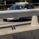
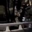

**Vehicle Detection Project**

The goals / steps of this project are the following:

* Perform a Histogram of Oriented Gradients (HOG) feature extraction on a labeled training set of images and train a classifier Linear SVM classifier
* Optionally, you can also apply a color transform and append binned color features, as well as histograms of color, to your HOG feature vector. 
* Note: for those first two steps don't forget to normalize your features and randomize a selection for training and testing.
* Implement a sliding-window technique and use your trained classifier to search for vehicles in images.
* Run your pipeline on a video stream (start with the test_video.mp4 and later implement on full project_video.mp4) and create a heat map of recurring detections frame by frame to reject outliers and follow detected vehicles.
* Estimate a bounding box for vehicles detected.

[//]: # (Image References)
[image1]: ./for_report/Fig1_1_1-Vehicle_and_non_vehicle.png

[image4]: ./for_report/Fig1_2_1_HOG_example_1.png
[image4_2]: ./for_report/Fig1_2_1_HOG_example_1_def.png
[image5]: ./for_report/Fig1_2_2_HOG_example.png
[image6]: ./for_report/Fig1_2_3_Spatial_img.png
[image7]: ./for_report/Fig1_2_4_Histgram.png
[image8]: ./for_report/test1.png
[image9]: ./for_report/test10.png
[video1]: ./project_video_w_pipline.avi

# 1. Training
## 1.1 Data preparation
 The process of data preparation is:
 * Step1: Download the data from the followin link.
 Link: 'https://s3.amazonaws.com/udacity-sdc/Vehicle_Tracking/vehicles.zip'
 Link: 'https://s3.amazonaws.com/udacity-sdc/Vehicle_Tracking/non-vehicles.zip'
 * Step2: Remove a part of images files from "Non-vehicle" data set
 * Step3: Augment some Non-Vehicle data
 
These 3 processes were done with "enviroment_setup.py".

The training data was provided by Udacity.  
About step3, the images aurgued were selected because these type of images are difficult to be classified.
The example of each step is shown in the following figures.

__Fig1.1.1 Example of data set__  
![alt text][image1]

__Fig1.1.2 Example of removed image__  

__Fig1.1.3 Example of argumentation__  

 These processes were done with "enviroment_setup.py"

## 1.2 Feture extraction
### Description for HOG

The parameter turning was done to detect the difference of the object with my eyes.
Default parameters are:
 - Orient:9
 - pix_per_cell:8
 - cell_per_block:2

I tuned the HOG parameters with my subjective check by my eyes.
 It is hard to recognize the difference between vehicle and non-vehicle images because of less number of features.
Then, I increased the number of the feature by decreasing the pix_per_cell and increasing cell_per_block step by step.
Once I recognize the difference of HOG image between the vehicle and non-vehicle image, I stop to tune it.
Updated parameters are:
- Orient: 9
- pix_per_cell: 5
- cell_per_block: 3

__Fig1.2.1 HOG image example__  
Default  
![alt text][image4_2]  

Tuned  
![alt text][image4]

 Note: Need update the image with low resonance.  

 About the color space, the grayscale was used to compute the HOG features.
 Becuase, Grayscale represents the shape of the object same as a single channel of a color image. 
 Fig1.2.2 shows the comparison between HOG images with Grayscale and L channel of HLS.
 I assumed that it is equivalent and Grayscale is enough.

__Fig1.2.2 HOG image comparison__  
![alt text][image5]

### Description for Binned color feature

I selected 16 as the size of the bin of the color features.  
Then, I can recognize the vehicle and non-vehicle with my subjective check by my eyes.

__Fig1.2.3 Binned feature example__  
![alt text][image6]

### Description for Histogram
I selected 16 as the size of the bin of the Histgram features.  
Then, I can recognize the vehicle and non-vehicle with my subjective check by my eyes.

__Fig1.2.4 Histgram difference__  
![alt text][image7]

## 1.3 Description the selection of feature and training

 For clasifier, SVM was applied. Used module is sklearn.svm.SVC. (main_training.py: line 109-118)  
 The followin 7 cases were computed as SVM model.  
 Then, the performance was checked in all cases with the test image from the project video.    
 The best performance was confirmed with the condition4.pickle and it was selected, even if the varidation score is lower than others.  

| Output file name | Color space | HOG | Spatial | Histogram | Validation score |
|:----------------:|:-----------:|:---:|:-------:|:---------:|:----------------:|
|condition1.pickle | RGB         | With| With    | with      |            0.9831|
|condition2.pickle | RGB         | With| With    | without   |            0.9774|
|condition3.pickle | RGB         | With| Without | with      |            0.9661|
|condition4.pickle | HLS         | With| With    | with      |            0.9661|
|condition5.pickle | HLS         | With| With    | without   |            0.9831|
|condition6.pickle | HLS         | With| Without | with      |            0.9718|
|condition7.pickle | No          | With| Without | without   |            0.9435|

__Fig1.2.5 Outcomes of test image__  
![alt text][image8]  

# 2. Pipeline for single image
## Basic flow
 The process is below.
 Step1: Apply HOG conversion to whole image (functionset.py: Line 252)  
 Step2: Apply feature extraction for each subimage (functionset.py: Line 269 - 288)  
 Step3: Judge whether sub image is vehicle or not (functionset.py: Line 291)  
 Step4: Compute how may times the pixcel was judged as "Vehicle" (functionset.py: Line 291 - 298)  
 Step5: Remove false positive based on threshould (functionset.py: Line 363 - 380)  
 Step6: Draw rectangle on the image based on each positive area (functionset.py: Line 382 - 409)

Note for Step2:
 Step2's size of the sub-image, sliding window, depends on the hog parameters, which was tuned in 1.2. 
 The window size for the image is controlled with scale. (functionset.py: Line 230 - 233)  
 In this project, single scale works well and I didn't apply the multiscale strategy. 
 
Note for Step4:  
If the max score in the image is lower than 10. the threshold of 10 was applied.  
Other cases, one-third of the max score in the image was applied as the threshold.  

Note for step6:  
If the rectangle aspect ratio is less than 3 or the area is less than 150 pixels, the rectangle is not applied to draw the rectangle.
(functionset.py: Line 403)

__Fig2.1 Ouput image example__  
![alt text][image9]  

# 3. Pipeline for video
 The basic pip line is same as the single image.
 The difference is 
 1. Add the results from previous frames
 2. Apply new thread from single image
 
 This function was added to reduce the false positive area, which randomly occurs in the image.

![alt text][video1]

# 4. Discussion
 The most difficult part was to handle false positive on the shadow.
 To reduce it, I applied 2 methods.

 1. Dynamic threashould
  If I tried to set the single threshold, I need to add a bigger number to remove the false positive. But this leads false negative in other video frames. 
  Then, to balance the value in each image, I applied the threshold which is changed by the maximum score in the image. 
 
 2. Using the previous frame
  In the video, the score of the vehicle area is more stable, not jump to other region frame by frame, than the false positive area. 
 I added the results over the frames to increase the score of vehicle area.
